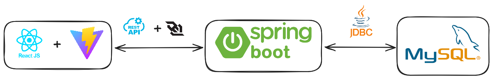
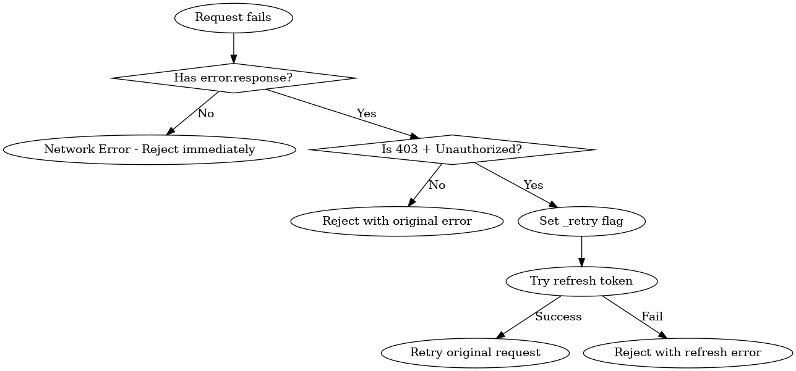

# Chat Application - Frontend

A real-time chat application frontend built with React, TypeScript, Vite, and Redux Toolkit. Features JWT authentication, WebSocket connections for real-time messaging, and a responsive Material-UI design.



## 🚀 Technologies Used

- **React 19** 
- **TypeScript** 
- **Vite** 
- **Redux Toolkit** 
- **Material-UI (MUI)** 
- **STOMP/SockJS** 

## 📋 Features

- User registration and login with JWT authentication
- Real-time messaging via WebSocket/STOMP
- Automatic token refresh
- Protected routes
- Responsive design with Material-UI
- Message history
- Type-safe codebase with TypeScript

## 🏗️ Project Structure

```
src/
├── components/
│   ├── auth/
│   │   ├── AuthHandler.tsx      # Authentication provider
│   │   ├── Login.tsx           # Login form
│   │   └── Register.tsx        # Registration form
│   ├── chat/
│   │   ├── ChatView.tsx        # Main chat interface
│   │   ├── ChatMessage.tsx     # Individual message component
│   │   └── MessageContainer.tsx # Message list container
│   ├── Layout.tsx              # Main layout wrapper
│   ├── ProtectedRoute.tsx      # Route protection
│   ├── Sidebar.tsx             # Navigation sidebar
│   └── WebSocketHandler.tsx    # WebSocket connection management
├── services/
│   └── Api.tsx                 # Axios configuration
├── store/
│   ├── store.ts               # Redux store configuration
│   ├── hooks.ts               # Typed Redux hooks
│   └── slices/
│       ├── authSlice.ts       # Authentication state
│       ├── chatViewSlice.ts   # Chat messages state
│       └── wsSlice.ts         # WebSocket state
├── style/
│   ├── index.css             # Global styles
│   └── ChatMessage.css       # Message styling
├── types/
│   └── custom.d.ts           # Custom type definitions
├── vite-env.d.ts             # Vite environment types
└── App.tsx                   # Main app component
```

## 🛠️ Installation & Setup

### Prerequisites
- Node.js (v22 or higher)
- npm or yarn

### Development Setup

1. **Clone the repository structure**
   ```bash
   # Create parent directory
   mkdir chat-application
   cd chat-application
   
   # Clone both repositories
   git clone <frontend-repository-url> chatapp-react-frontend
   git clone <backend-repository-url> chatapp-spring-backend
   ```

2. **Install dependencies**
   ```bash
   cd chatapp-react-frontend
   npm install
   ```

3. **Environment Configuration**
   ```bash
   # Copy example environment file
   cp .env.example .env
   ```
   
   Configure the following variables in `.env`:
   ```env
   VITE_API_BASE_URL=http://localhost:8080/api/v1
   VITE_WS_BASE_URL=http://localhost:8080/ws
   ```

4. **Start development server**
   ```bash
   npm run dev
   ```

5. **Access the application**
   - Open `http://localhost:5173` in your browser

## 🐋 Docker Setup

### Development with Docker
```bash
# From parent directory containing both repos
cd chatapp-spring-backend
docker-compose -f docker-compose.dev.yml up --build
```

### Production with Docker
```bash
# From parent directory containing both repos
cd chatapp-spring-backend
docker-compose up --build
```

## 🔧 Configuration

### API Configuration
The API base URL is configured in [`src/services/Api.tsx`](src/services/Api.tsx):
```typescript
const api = axios.create({
  baseURL: env.VITE_API_BASE_URL,
  withCredentials: true
});
```

### Redux Store
State management is configured in [`src/store/store.ts`](src/store/store.ts) with three main slices:
- **authSlice** - User authentication and token management
- **wsSlice** - WebSocket connection state
- **chatViewSlice** - Chat messages and UI state

Typed hooks are provided in [`src/store/hooks.ts`](src/store/hooks.ts) for type-safe Redux usage:
```typescript
export const useAppDispatch = () => useDispatch<AppDispatch>();
export const useAppSelector: TypedUseSelectorHook<RootState> = useSelector;
```

## 🔐 Authentication Flow

1. User registers/logs in via [`Login.tsx`](src/components/auth/Login.tsx) or [`Register.tsx`](src/components/auth/Register.tsx)
2. JWT tokens are received and stored via [`AuthHandler`](src/components/auth/AuthHandler.tsx)
3. Protected routes are accessed through [`ProtectedRoute`](src/components/ProtectedRoute.tsx)
4. Automatic token refresh handles expired access tokens

## 💬 Real-time Messaging

The application uses WebSocket/STOMP for real-time communication:
- Connection managed by [`WebSocketHandler`](src/components/WebSocketHandler.tsx)
- Messages sent to `/app/chat` endpoint
- Real-time updates received from `/topic/messages`
- Message state managed in [`chatViewSlice`](src/store/slices/chatViewSlice.ts)

## 📊 State Management

### Auth State
```typescript
{
   token: string | null,
   user: {
      email: string | null, 
      name: string | null,
      uid: string | null
   },
   isValidating: boolean,
}
```

### Chat State
```typescript
{
  chatViewCollection: [{
    viewId: number,
    title: string,
    messages: Message[],
    isLoading: boolean,
    error: string | null
  }]
}
```

### WebSocket State
```typescript
{
  stompClient: Client | null,
  connectionStatus: 'connected' | 'disconnected' | 'connecting' | 'error'
}
```

## 🎨 Styling

- **Material-UI (MUI)** for modern, responsive components
- **Custom CSS** in [`src/style/`](src/style/) for chat-specific styling
- **FontAwesome** icons for UI elements
- Dark theme with customizable Material-UI theming

## 📱 Responsive Design

The application is fully responsive with:
- Material-UI Grid system
- Flexible chat container sizing
- Responsive message bubbles
- Adaptive sidebar layout

## 🔍 Key Components

### ChatView
The main chat interface that handles:
- Message display and input
- WebSocket subscription management
- Real-time message updates
- Send message functionality

### MessageContainer
Displays chat messages with:
- Auto-scrolling to latest messages
- User/other message differentiation
- Sender name display

### AuthHandler
Manages authentication state:
- Token storage and validation
- Automatic token refresh
- User session management
- Request/response interceptors

## 📋 Dependencies

### Production Dependencies
- `react` & `react-dom` - Core React (v19)
- `@reduxjs/toolkit` & `react-redux` - State management
- `react-router-dom` - Routing
- `axios` - HTTP requests
- `@stomp/stompjs` - WebSocket messaging
- `sockjs-client` - SockJS WebSocket fallback
- `@mui/material` - Material-UI components
- `@fortawesome/*` - Icons

### Development Dependencies
- `typescript` - TypeScript compiler
- `vite` - Build tool
- `eslint` - Code linting
- `@typescript-eslint/*` - TypeScript ESLint plugins
- Various type definitions (`@types/*`)

## 🚀 Deployment

### Using Docker (Recommended)
The application is containerized and deployed using Docker Compose from the backend repository.

### Manual Deployment
1. **Build the application**
   ```bash
   npm run build
   ```

2. **Deploy the `dist` folder** to your web server (served by Nginx in production)

3. **Configure environment variables** for production API URLs

## 🐛 Troubleshooting

### Common Issues

1. **WebSocket connection fails**
   - Check backend WebSocket configuration
   - Verify CORS settings
   - Ensure backend is running
   - Check token is properly encoded in WebSocket URL

2. **Authentication issues**
   - Check token expiration
   - Verify API endpoints
   - Clear browser storage if needed
   - Check localStorage for `accessToken`

3. **Build errors**
   - Update dependencies
   - Check Node.js version compatibility

## 📚 Documentation

#### Token Refresh Flowchart

*Token refresh mechanism*

Additional documentation available in the [backend repository](https://github.com/YoungDev7/chatapp-spring-backend):
- Architecture diagrams
- Sequence diagrams
- API integration guides

## 🔗 Related Projects

- [Backend Repository](https://github.com/YoungDev7/chatapp-spring-backend) - Spring Boot backend application

## 📄 License

This project is licensed under the MIT License.

---

**Note**: This frontend is designed to work with the corresponding Spring Boot backend. Ensure both applications are running for full functionality.